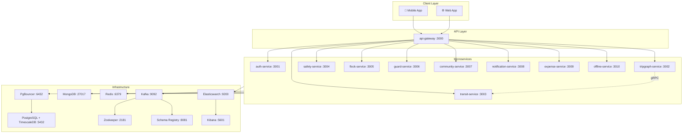
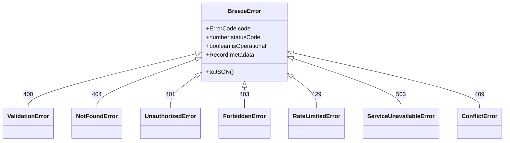
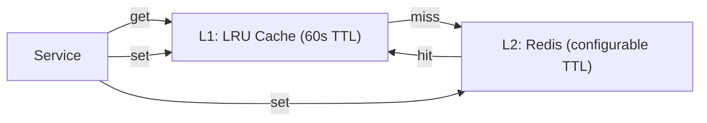
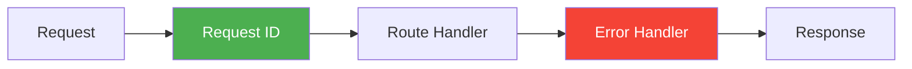
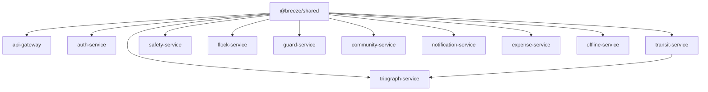

# 🌬️ Breeze Monorepo — Developer Guide

> AI-powered door-to-door travel intelligence platform for India.
> Enterprise monorepo foundation — zero application logic, pure infrastructure.

---

## Architecture Overview



---

## Monorepo Structure

```
breeze/
├── packages/
│   ├── shared/                    # @breeze/shared — core library
│   │   └── src/
│   │       ├── types/             # TypeScript interfaces + Zod schemas
│   │       ├── errors/            # BreezeError class hierarchy
│   │       ├── middleware/
│   │       │   ├── express/       # Error handler + request-id
│   │       │   └── fastify/       # Error handler + request-id
│   │       ├── kafka/             # KafkaFactory + typed event payloads
│   │       ├── redis/             # RedisFactory + L1/L2 cache
│   │       ├── grpc/              # gRPC channel factory (K8s keepalive)
│   │       └── utils/             # Geo (haversine), LRU cache
│   └── proto/                     # gRPC protocol buffer definitions
│       ├── common.proto           # Location, TransitNode, TripLeg
│       ├── auth.proto             # AuthService RPCs
│       ├── tripgraph.proto        # TripGraphService RPCs
│       └── transit.proto          # TransitService RPCs
├── services/                      # 11 microservice scaffolds
├── infra/                         # K8s, Docker, Terraform (placeholders)
├── docker-compose.yml             # 9 infrastructure services
├── turbo.json                     # Turborepo pipeline config
└── tsconfig.json                  # Root TypeScript config (strict)
```

---

## Phase Breakdown

### Phase 1 — Root Configuration
| File | Purpose |
|------|---------|
| `package.json` | npm workspaces monorepo root |
| `turbo.json` | Build pipeline with dependency ordering |
| `tsconfig.json` | `strict`, `exactOptionalPropertyTypes`, `noUncheckedIndexedAccess` |
| `.gitignore` | Node, dist, env, Terraform, IDE files |
| `.editorconfig` | Consistent formatting across editors |
| `.prettierrc` | Single quotes, trailing commas, 100 char width |

### Phase 2 — Shared Core Libraries

**Error Hierarchy:**



**Geo Utils:** `haversineKm`, `haversineMeters`, `isWithinRadius`, `latLngToTileXYZ`

**LRU Cache:** Single canonical `createServiceCache<T>(name, maxSize, ttlSeconds)` factory. All services MUST use this — no per-service reimplementations.

### Phase 3 — Infrastructure Factories

**Kafka (`KafkaFactory`):**
- Idempotent producer (`maxInFlightRequests=1`)
- Type-safe `emit<T>(topic, key, value)` with automatic header injection
- Headers: `x-trace-id`, `x-produced-at`, `x-schema-version`

| Topic | Payload Type |
|-------|-------------|
| `breeze.trip.created` | `TripCreatedPayload` |
| `breeze.trip.updated` | `TripUpdatedPayload` |
| `breeze.booking.confirmed` | `BookingConfirmedPayload` |
| `breeze.safety.alert` | `SafetyAlertPayload` |
| `breeze.notification.dispatch` | `NotificationDispatchPayload` |
| `breeze.expense.recorded` | `ExpenseRecordedPayload` |
| `breeze.user.activity` | `UserActivityPayload` |

**Redis (`RedisFactory`):**



- `TypedRedisClient` with `getJSON`, `setJSON`, `setExJSON`, sorted set ops, etc.
- All failures throw `ServiceUnavailableError`
- `createLruRedisCache<T>()` — L1 (in-process, 60s) + L2 (Redis, custom TTL)

**gRPC (`createGrpcChannel`):**

| Option | Value | Rationale |
|--------|-------|-----------|
| `keepalive_time_ms` | 30000 | Ping every 30s |
| `keepalive_timeout_ms` | 10000 | 10s for response |
| `keepalive_permit_without_calls` | 1 | Ping even when idle |
| `http2.max_pings_without_data` | 0 | Unlimited idle pings |

### Phase 4 — Middleware



- **Express & Fastify** error handlers — `BreezeError` → structured JSON, non-operational → 500 + alert log
- **Request ID** — UUID attached to `req.requestId`, echoed as `X-Request-ID` header
- **Observability** — OpenTelemetry SDK with OTLP traces/metrics, W3C propagation, auto-instrumentation (HTTP, Express, Fastify, pg, MongoDB, Redis)

### Phase 5 — Proto Definitions

| Service | RPCs |
|---------|------|
| `AuthService` | `ValidateToken`, `GetUserProfile` |
| `TripGraphService` | `SearchRoutes` |
| `TransitService` | `GetTrainOptions`, `GetLocalOptions` |

### Phase 6 — Service Scaffolding

All 11 services have: `package.json`, `tsconfig.json`, `src/index.ts`. API Gateway also has a multi-stage `Dockerfile`.

| Service | Port | Domain |
|---------|------|--------|
| api-gateway | 3000 | Request routing & aggregation |
| auth-service | 3001 | Authentication & user profiles |
| tripgraph-service | 3002 | Multi-modal route computation |
| transit-service | 3003 | Real-time train/bus/metro data |
| safety-service | 3004 | SOS, geofencing, safety alerts |
| flock-service | 3005 | Group travel coordination |
| guard-service | 3006 | Real-time location sharing |
| community-service | 3007 | Forums, reviews, local insights |
| notification-service | 3008 | Push, SMS, email, in-app |
| expense-service | 3009 | Trip expense tracking |
| offline-service | 3010 | Offline data sync |

### Phase 7 — Docker Compose Infrastructure

```bash
docker compose up -d    # Start all infrastructure
docker compose ps       # Check health status
docker compose down -v  # Tear down with volumes
```

---

## Getting Started

```bash
# 1. Clone and install
cd breeze
npm install

# 2. Start infrastructure
docker compose up -d

# 3. Build shared library
npm run build --workspace=@breeze/shared

# 4. Build all packages
npm run build

# 5. Develop a specific service
npm run dev --workspace=@breeze/api-gateway
```

## Naming Conventions

| Entity | Convention | Example |
|--------|-----------|---------|
| Files & folders | kebab-case | `error-handler.ts` |
| Classes | PascalCase | `BreezeError` |
| Functions & variables | camelCase | `createServiceCache` |
| Constants | SCREAMING_SNAKE | `KAFKA_TOPICS` |

## Dependency Graph



> [!IMPORTANT]
> `tripgraph-service` depends on `transit-service` — this is enforced in both `turbo.json` and `tsconfig.json`.

---

## Verification

✅ `npm install` — all workspace packages resolve  
✅ `npx tsc --noEmit -p packages/shared/tsconfig.json` — **zero errors**  
✅ TypeScript strict mode with `exactOptionalPropertyTypes` enforced  
✅ No `any` types anywhere in the codebase  
✅ All async functions use `async/await`  
✅ All exported functions have JSDoc with `@param` + `@returns`
